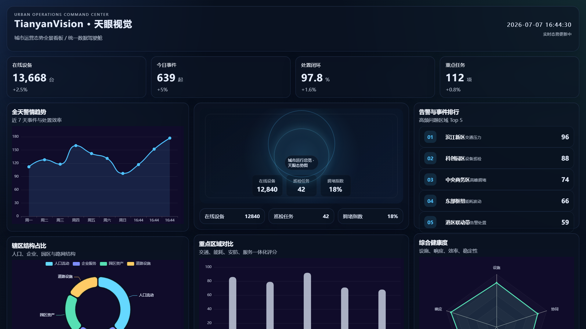

# RuyiBigScreen ｜ 天眼视觉

教学型数据可视化大屏项目 —— 从 0 到 1 学习如何搭建一个完整的数据大屏。

## 项目预览



## 项目简介

这是一个面向**前端初学者**和**数据可视化学习者**的开源教学项目。

项目以"城市运营态势总览"为场景，完整展示了一个数据大屏从项目搭建、组件拆分、图表封装、mock 数据设计到自动化截图的全部过程。代码结构清晰，注释克制但意图明确，适合作为学习 Vue 3 工程化实践的参考案例。

**适合谁：**

- 正在学习 Vue 3 和 TypeScript 的前端初学者
- 想了解 ECharts 如何与 Vue 组件结合的学生
- 需要数据大屏项目作为课程作业或毕设参考的同学
- AI 辅助编程课堂教学案例

**不适合谁：**

- 直接用于生产环境的城市运营系统（本项目使用 mock 数据）
- 需要接入真实物联网设备或实时数据推送的场景

## 核心特性

- **完整的 Vue 3 项目结构**：Composition API + TypeScript + Pinia 状态管理
- **四种 ECharts 图表封装**：折线图、饼图、柱状图、雷达图，统一通过 `chartBase` 初始化
- **模拟实时数据变化**：KPI 数字跳动、趋势图滚动、排行榜刷新、时间线新增，均在纯前端完成
- **数据大屏经典布局**：1920 x 1080 标准分辨率，三栏网格 + 底部联动区域
- **服务层与 mock 分离**：通过 `VITE_USE_MOCK` 环境变量即可切换数据源，页面与图表组件无需改动
- **自动化截图能力**：基于 Playwright 的截图脚本，可一键生成展示用截图
- **深色科技风主题**：玻璃拟态面板 + 网格背景 + 暗色渐变，适合大屏展示
- **工程化规范**：ESLint + Prettier + Stylelint + Husky + lint-staged，代码风格统一
- **单元测试覆盖**：Vitest 覆盖 mock 数据、模拟器和核心服务层

## 技术栈

| 类别 | 技术 |
|------|------|
| 前端框架 | Vue 3（Composition API） |
| 构建工具 | Vite 6 |
| 类型系统 | TypeScript |
| 图表库 | ECharts 5 |
| 状态管理 | Pinia |
| HTTP 客户端 | Axios |
| 日期处理 | dayjs |
| 样式方案 | SCSS + PostCSS |
| 单元测试 | Vitest + happy-dom |
| 自动化截图 | Playwright |
| 代码规范 | ESLint + Prettier + Stylelint |
| Git 钩子 | Husky + lint-staged |

## 页面内容

大屏页面包含以下模块：

**顶部标题栏**
- 项目标题与副标题
- 实时时钟，每秒更新
- 运行状态指示

**核心指标卡片（KPI 行）**
- 在线设备数
- 今日事件量
- 处置闭环率
- 重点任务数
- 每项卡片附带趋势变化

**左栏**
- 全天警情趋势（折线图）：展示近 7 天事件量与处置效率变化
- 辖区结构占比（饼图）：人口流动、企业服务、园区资产、道路设施分布

**中央区域**
- 如意数据中枢：城市运行总览态势图，展示在线设备、巡检任务、拥堵指数
- 重点区域对比（柱状图）：滨江、科创、CBD 等区域综合评分对比

**右栏**
- 告警与事件排行：高频问题区域 Top 5 排行榜
- 综合健康度（雷达图）：设施、响应、效率、稳定性、协同五维评估

**底部**
- 今日联动处置流（时间线）：告警派发、接单、到场、闭环全流程

## 实时数据模拟

项目内置了一套实时数据模拟器（`realtimeDashboardSimulator.ts`），在纯前端环境下模拟以下动态效果：

- KPI 指标数值随时间微幅波动，趋势标签联动更新
- 折线图数据按时间窗口滑动，模拟实时流量变化
- 排行榜名次定期重排
- 饼图占比低频微调，总和始终为 100%
- 雷达图五维分值缓慢变化
- 底部时间线每隔数秒插入新事件，模拟联动处置流

所有变化均在前端内存中完成，不依赖任何后端服务。变化频率可通过 store 中的 `startRealtime(intervalMs)` 参数调整，当前默认每 2 秒刷新一帧。

## 项目结构

```
RuyiBigScreen/
├── scripts/
│   └── capture-dashboard.mjs   # 自动化截图脚本
├── src/
│   ├── components/
│   │   ├── charts/             # ECharts 图表组件（Line / Pie / Bar / Radar）
│   │   └── layout/             # 布局组件（ChartCard / KpiCard / DataHub / RankingList / FlowTimeline）
│   ├── mocks/
│   │   ├── dashboardMock.ts            # 静态 mock 数据
│   │   └── realtimeDashboardSimulator.ts  # 实时模拟器
│   ├── pages/
│   │   └── dashboard/
│   │       └── DashboardPage.vue       # 大屏主页面
│   ├── services/
│   │   └── dashboardService.ts         # 数据访问服务层
│   ├── store/
│   │   └── dashboardStore.ts           # Pinia 状态管理
│   ├── styles/
│   │   ├── global.scss                 # 全局样式
│   │   └── theme.scss                  # 主题变量
│   ├── tests/
│   │   └── unit/                       # 单元测试
│   ├── types/
│   │   └── dashboard.ts                # 类型定义
│   ├── App.vue
│   └── main.ts
├── docs/
│   └── screenshots/                    # 项目截图（Git 跟踪）
├── .gitignore
├── .prettierrc.json
├── eslint.config.js
├── stylelint.config.cjs
├── tsconfig.json
├── vite.config.ts
├── vitest.config.ts
├── package.json
├── LICENSE
└── README.md
```

## 快速开始

### 环境要求

- Node.js >= 18
- npm >= 9

### 安装与启动

```bash
# 克隆项目
git clone <repo-url>
cd RuyiBigScreen

# 安装依赖
npm install

# 启动开发服务
npm run dev -- --host 127.0.0.1 --port 10001
```

浏览器访问：

```
http://127.0.0.1:10001/
```

> 项目默认使用 mock 数据，无需配置任何后端即可看到完整大屏效果。

## 常用命令

| 命令 | 说明 |
|------|------|
| `npm run dev` | 启动开发服务（默认端口 5173，建议使用上方命令指定 10001） |
| `npm run build` | TypeScript 类型检查 + 生产构建 |
| `npm run preview` | 预览构建产物 |
| `npm run lint` | ESLint 代码检查 |
| `npm run format` | Prettier 格式化 |
| `npm run format:check` | 检查代码格式 |
| `npm run test` | 运行单元测试 |
| `npm run test:watch` | 监听模式运行测试 |
| `npm run screenshot` | 自动化截图（需先启动开发服务） |

## 数据源说明

本项目的服务层位于 `src/services/dashboardService.ts`。

**默认模式（mock）：**

项目启动后自动进入 mock 模式，数据由 `realtimeDashboardSimulator` 动态生成。页面呈现的所有数据变化均为前端模拟，不依赖任何后端。

**切换到真实 API：**

当需要接入真实后端时：

1. 设置环境变量 `VITE_USE_MOCK=false`
2. 在 `src/services/dashboardService.ts` 中实现真实的 API 调用逻辑
3. 确保 API 返回的数据结构符合 `src/types/dashboard.ts` 中的 `DashboardOverview` 类型

页面组件和图表封装层无需任何修改，因为它们只依赖数据类型和 Pinia store 的接口。

## 自动化截图

项目内置了 Playwright 截图脚本，可一键生成 1920 x 1080 的大屏展示截图：

```bash
# 1. 先启动开发服务
npm run dev -- --host 127.0.0.1 --port 10001

# 2. 执行截图
npm run screenshot
```

截图会自动保存到：

```
docs/screenshots/dashboard-1920x1080.png
```

截图脚本的行为：
- 自动创建输出目录
- 等待页面核心元素和 ECharts 图表全部渲染完成
- 等待实时数据至少刷新一轮（约 5 秒）
- 收集浏览器控制台错误，如有错误则保留截图但以失败退出
- 以 1920 x 1080 视口截图，不截长图

## 测试与质量保障

### TypeScript 类型检查

构建命令 `npm run build` 内置了 `vue-tsc -b` 类型检查，确保整个项目的类型安全。

### 单元测试

```bash
npm run test
```

使用 Vitest 运行，覆盖 mock 数据完整性、模拟器行为约束和服务层返回值。

### 代码规范

```bash
npm run lint          # ESLint 检查（零警告容忍）
npm run format:check  # Prettier 格式检查
```

项目配置了 Husky 和 lint-staged，Git 提交前自动运行 Prettier 格式化。

## 适合学习什么

通过阅读和实践本项目，你可以学习：

- **Vue 3 工程结构**：Composition API、`<script setup>`、组件拆分思路
- **数据大屏布局**：CSS Grid 三栏布局、1920 x 1080 固定比例适配
- **ECharts 图表封装**：统一的 `chartBase` 初始化、`setOption` 响应式更新
- **mock 与 service 分层**：数据模拟层和服务层的职责分离
- **Pinia 状态管理**：集中式的数据 store 与组件间数据传递
- **实时模拟设计**：定时器驱动的数据帧更新、边界约束和随机策略
- **TypeScript 类型定义**：为数据结构定义清晰的接口
- **自动化截图**：用 Playwright 编写可靠的页面截图脚本
- **前端工程化**：ESLint、Prettier、Stylelint、Husky、lint-staged 的配置与使用

## 后续计划

- 增加更多图表类型（散点图、热力图、飞线图）
- 支持主题切换（亮色 / 暗色）
- 接入 MSW（Mock Service Worker）作为更规范的 mock 方案
- 编写 Playwright E2E 端到端测试
- 增加视觉回归测试，对比截图差异
- 提供 Docker 部署方案
- 录制配套教学视频或编写系列教程文章

## License

本项目基于 [MIT License](LICENSE) 开源。

---

如果你觉得这个项目对学习有帮助，欢迎 Star 和分享给更多同学。
